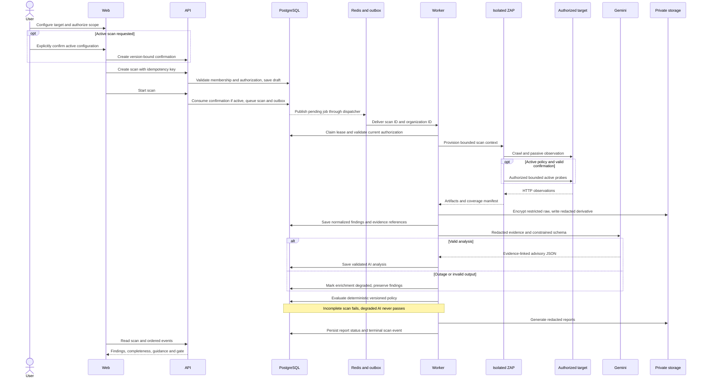

# Containers and execution boundaries

| Container/system | Responsibility | Trust, communication and failure behavior |
| --- | --- | --- |
| Web | React public site and authenticated application | Same-origin HTTPS API; no provider/storage secrets; display evidence separately from generated advice |
| API | FastAPI authentication, RBAC, validation, resources, orchestration commands | PostgreSQL transactions and outbox; never execute ZAP in request process; bounded request sizes |
| Worker | Celery scan orchestration, normalization, enrichment, reports, deliveries | Separate queues/identities for scan and notification work; leases and fencing; no broad host access |
| Scanner runner | Narrow per-scan container provisioning | Runs pinned ZAP, enforces CPU/RAM/deadline/network scope, exposes no arbitrary execution or Docker socket |
| ZAP | Spider/passive/authorized active scanning | Disposable non-root restricted container; target-only egress, no API/database/metadata access; resource limits |
| PostgreSQL | Authoritative tenant records, state/events, outbox and policy versions | Tenant-safe constraints, transaction/CAS transitions, backups; queue loss must not lose scans |
| Prometheus | Metrics storage scaffold; no scrape targets or rules | Internal observability network only; no published ports; read-only `infra/prometheus/prometheus.yml`; named `prometheus_data` volume at `/prometheus` |
| Grafana | Provisioned Prometheus datasource; no dashboards or alerts | Internal observability network only; datasource auto-loaded from `infra/grafana/provisioning/datasources/prometheus.yml` using `http://prometheus:9090`; named `grafana_data` volume at `/var/lib/grafana` |
| Redis | Celery transport, transient locks and rate limits | Private authenticated transport; no scanner evidence or durable truth; recover from database/outbox |
| Filesystem / S3 | Encrypted evidence and generated report bytes | Separate restricted raw and redacted/report namespaces; tenant-scoped metadata, private buckets, lifecycle deletion |
| Gemini | Schema-constrained advisory analysis | Redacted minimal input; timeouts/retry budget; provider status separate from findings; no gate authority |
| GitHub Actions | Build/test target, submit scan, await gate | Scoped API key or integration credential; signed webhooks deduplicated; required checks configured in repository |
| Notifications | SMTP, Slack, generic webhook, GitHub PR delivery | Transactional outbox, sanitized minimal summaries, SSRF protection, delivery retry/dead-letter status |
| Production platform | EC2 workloads, RDS PostgreSQL, ElastiCache Redis, S3, CloudWatch, optional ALB | Private data services, least privilege IAM, TLS, separate scanner network and secret manager; restore exercises |

## Deployment and orchestration rules

Local Compose provides API, web, worker, PostgreSQL, Redis, Prometheus and Grafana; the restricted runner is distinct from the API. Development storage uses filesystem through the same interface as private S3. Mock/disabled AI is supported locally and visibly indicated. Production rejects mock mode. CloudWatch receives structured metadata, not raw findings, bodies or secrets.

Create scan plus outbox message atomically. Dispatcher publishes at least once; worker claims a scan using a lease and fencing token. PostgreSQL records every transition and ordered event before client notification. Delivery and report side effects have unique job keys. Queue consumers reconstruct progress after restart; no blind replay of active probes. If scanner continuity or evidence completeness cannot be established, fail the run and create a separately authorized retry scan.

## Scan sequence

Failure transitions, component retry exhaustion, cancellation and fencing are specified in SCAN_STATE_MACHINE. This diagram illustrates a successful scanner path with enrichment degradation; it does not imply scanner failures proceed as clean scans.

## Observability scaffold

Prometheus and Grafana start in both development and production Compose configurations, with readiness health checks. Neither publishes a host port. Their dedicated `internal: true` network is separate from API, worker, database and scanner networks. Configurations are mounted read-only; data survives restarts and container recreation through named volumes (do not use `down --volumes` when retaining data). Grafana loads the default, non-editable Prometheus datasource on startup without UI setup. No new environment variables are required; Grafana retains its image-default initial login behavior and has no public ingress. Access/authentication hardening belongs with later deployment work.

This is infrastructure only: empty scrape configuration, no dashboards, alert rules or monitoring coverage. Grafana-based abuse monitoring and observability dashboards remain deferred to Phases 16/17.
