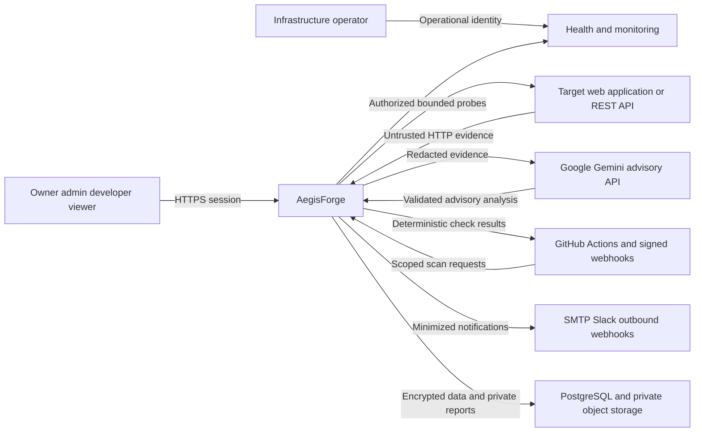

# System context

## Actors and responsibilities

- Organization owner: organization lifecycle, ownership transfer, administrative control.
- Administrator: membership, assigned resources, target authorization review, policies, integrations and audit review in one organization.
- Developer: manage assigned projects/targets, request authorized scans, inspect evidence and guidance, triage findings, generate reports.
- Viewer: read assigned project results and redacted reports; cannot scan or mutate.
- Operator: infrastructure health and recovery through a separate operational identity, without automatic tenant-data access.
- GitHub Actions: scoped service actor requesting scans and consuming deterministic gates for a project.

## External systems and boundaries

Authorized target applications and API definitions are untrusted inputs even when owned by the user. ZAP records observations. Gemini receives only redacted evidence excerpts and returns untrusted advisory JSON. GitHub sends signed repository events and consumes checks; SMTP, Slack and webhook destinations receive minimized notifications. AWS provides private persistence and monitoring; logs exclude content/secrets. The browser is untrusted and cannot assert roles, completed scan status or gate outcomes.

## Product boundary

Includes scanning, evidence preservation, explanation, lifecycle tracking, policy gates, reports, analytics and administration. Does not claim complete vulnerability coverage, automatic exploitation proof for every alert, autonomous repository patching, payment processing or guaranteed compliance. A scan may find zero issues without proving an application secure. Marketing examples and seeded demonstrations must be labeled.

The synopsis's nine modules map to phases and tests in BUILD_PLAN and TEST_MATRIX. Its fourteen-week chart is planning context, not a measured delivery commitment.
