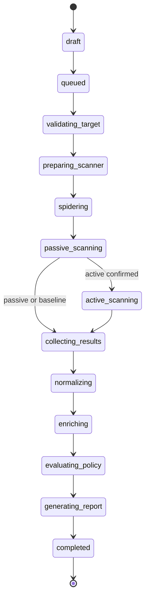

# Scan state machine

## Independent attributes

`state` is the processing state below. `completeness` is `unknown | complete | partial | none`; it becomes complete only after a validated coverage/artifact manifest and normalization for all required stages. `enrichment_status` is `pending | complete | degraded | disabled | mock`. `report_status` is `pending | complete | failed`. Policy outcome is `pass | warn | fail`, stored separately. No result uses `completed` as a synonym for clean.

## Valid forward transitions

Only the following forward edges exist. No implicit self-transitions or backward transitions. Within-stage retries are attempts recorded as events, not state changes.

| Source | Destination | Guard and responsible actor |
| --- | --- | --- |
| draft | queued | API start command: tenant/project permission, valid authorization, immutable target/policy snapshot, active confirmation consumed if required, transactional outbox |
| queued | validating_target | Worker obtains lease/fencing token; deadline not expired |
| validating_target | preparing_scanner | Recheck authorization/scope/DNS/redirect/egress and target reachability; all pass |
| preparing_scanner | spidering | Pinned isolated scanner healthy and correct network policy installed |
| spidering | passive_scanning | Discovery/import stage finished with validated coverage; API policy imports spec and performs bounded endpoint discovery here |
| passive_scanning | active_scanning | Frozen policy requires active mode and validated active grant remains effective |
| passive_scanning | collecting_results | Frozen policy does not require active mode; the alternative edge is mutually exclusive |
| active_scanning | collecting_results | Required active work completed within scope |
| collecting_results | normalizing | Artifact manifest captured and restricted raw bytes persisted; missing/corrupt required artifact fails instead |
| normalizing | enriching | All available alerts normalized and stored; completeness explicitly set (partial allowed but cannot pass) |
| enriching | evaluating_policy | All analysis attempts complete, or bounded retries exhausted; outage/disabled/mock sets non-complete enrichment |
| evaluating_policy | generating_report | Immutable deterministic evaluation persisted, including completeness and enrichment status |
| generating_report | completed | Reports persisted or report retries exhausted and report_status=failed; durable results/evaluation exist |

## Terminal transitions and race precedence

From any nonterminal state (`draft` through `generating_report`), `cancelled` is valid on an authorized cancellation command. Set `cancellation_requested_at` and revoke the execution fence atomically; terminate runner and enqueue cleanup. Cancellation after completion returns 409 and cannot rewrite history.

From any nonterminal state, `timed_out` is valid when its persisted deadline expires (draft expiry 24 hours; execution/queue deadlines set by policy when queued). From any nonterminal state, `failed` is valid on an unrecoverable validation, dispatch, scanner, storage, normalization or policy-engine error. Draft expiration is timed_out, not a clean abandoned scan. Infrastructure reconciliation may apply these transitions using a valid service identity and audit event.

Transitions use CAS on version plus state plus fencing token. Once a terminal transition commits, subsequent transitions fail with conflict. For a worker's forward transition, check committed cancellation first, then deadline, then fatal error before advancing. Across racing transactions the first valid committed terminal transition wins. Every terminal state has no outgoing edges. Retrying creates a new draft scan with retry_of_scan_id, then follows normal start and confirmation rules.

For failed/cancelled/timed_out: preserve available evidence with completeness `partial` or `none`, record a system fail gate based on incomplete execution, and never resolve previous findings. If the policy service/storage is unavailable, return effective gate `fail` with reason `evaluation_unavailable` until a durable fail evaluation can be recorded. Do not fabricate a persisted evaluation ID. A partial scan that completes downstream processing remains visibly partial and fails its gate.

## Degradation, findings and recovery

AI outage or invalid JSON exhausts bounded attempts and proceeds to policy with `degraded`; findings remain. Complete evidence plus degraded/disabled/mock enrichment produces at least warn, configurable to fail; never pass. Existing security failures remain fail. Report generation failure is visible/retryable, does not erase results, and cannot improve a gate; policies may require a report and add a fail delivery check. When report availability changes, create a new immutable deterministic evaluation using the same frozen policy and the updated report status before publishing the final gate; this is a within-stage operation, not a backward scan transition. A report retry is a separate job, not a scan-state rewind.

A policy-engine exception terminates failed. Zero observations are not zero vulnerabilities unless scope and coverage completed. Resolution inference requires a complete comparable scan (same target/scope and adequate rule coverage); otherwise leave prior findings unresolved. Live UI shows stage, completeness, component status and gate separately.

Worker heartbeat expiry triggers reconciliation. Resume only if the runner's identity, fence and artifact checkpoint prove continuity; otherwise fail `worker_lost`. Cancel/timeout revokes egress and terminates workloads; independent TTL cleanup handles unavailable runners. Old workers cannot persist state or side effects after their fence changes. Bound retries, scan duration, crawl depth, response size and total requests per immutable policy version.

The diagram shows forward execution only. The universal terminal edges are defined precisely above to avoid a visually dense diagram; they apply to every listed nonterminal state, including draft.

## Phase 7 mock-only implementation

The graph and terminal guards above are now enforced by the orchestration service. The sole executable adapter is a network-free `mock-v1` fixture. Its collection/normalization/enrichment/evaluation/report stages simulate lifecycle checkpoints on an explicitly labeled demo scan; they do not satisfy the real evidence/report guards above. Its completion remains partial with an effective fail gate, and cannot resolve findings or complete onboarding. Real adapter implementation must fulfill all production guards before enabling target traffic. See [orchestration contract](../SCAN_ORCHESTRATION.md).

## Phase 8 real evidence collection

The opt-in ZAP provider now executes through isolated worker jobs. Sanitized progress advances execution stages while preserving one job/fence. For real scans only, successful immutable artifact collection permits `collecting_results -> completed` with completeness `partial`, pending downstream component statuses and effective gate `fail / evaluation_unavailable`. This phase-specific terminal path does not satisfy the future normalization/evaluation/report guards. Mock scans retain their labeled lifecycle simulation. See [scanner execution](../SCANNER.md).
